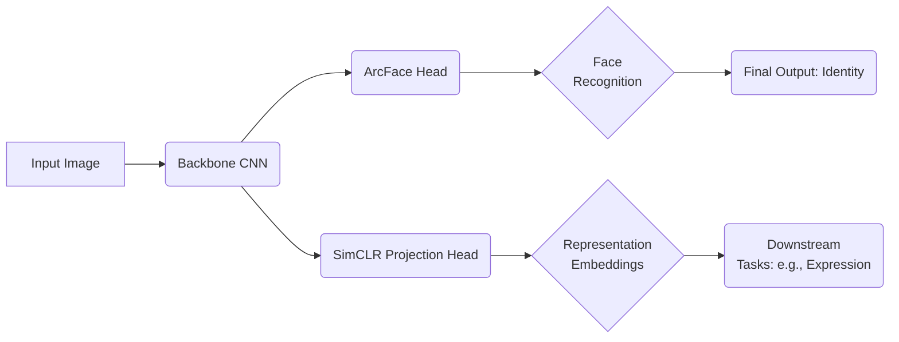

## • Goal
- Develop a **user-aware, emotion-recognizing model** that combines **face recognition** and **representation learning**.
- Integrate **test-time adaptation** for robust performance across various datasets (e.g., Koln, FERV39K, DFEW).
- Optimize the final model for **NVIDIA Orin** inference, including **Docker** environment setup, **ONNX** conversion, **quantization**, and **TensorRT** deployment.

 

## 1. Project Overview

### 1.1 Face Recognition (Test-Time Adaptation)
- **Motivation**: Achieve stable, adaptive face recognition under shifting data distributions.
- **Approach**:  
  - **Research relevant papers** on test-time adaptation.  
  - **Apply adaptation** to the Koln dataset for validation.
- **Outcome**: Dynamically adjust model parameters at inference to handle changing lighting, poses, or partial occlusions.

 

### 1.2 Face Expression Recognition
- **Datasets**:  
  - **FERV39K**: Primary dataset for expression recognition training.  
  - **DFEW**: Additional dataset for testing and benchmarking.
- **Key Steps**:  
  1. **Model design** and architecture exploration.  
  2. **Dataset preparation** (FERV39K, DFEW).  
  3. **Training code** implementation.  
  4. **Performance measurement** on both datasets to assess generalization.

 

## 2. Face Recognition + Representation Learning (VFM)
A major component of this project is the **Face Recognition + Representation Learning** pipeline. This approach not only identifies faces but also learns a powerful latent representation that generalizes across multiple tasks, including expression recognition and test-time adaptation.

### 2.1 Representation Learning Research
- Investigated **ArcFace** for robust face embeddings.  
- Explored **SimCLR**-style contrastive learning for self-supervision.

### 2.2 Model Design
The pipeline combines **ArcFace** for identity verification and **SimCLR** to learn generalizable representations. The model architecture is split into:

1. **Backbone**  
   - A CNN-based feature extractor (e.g., ResNet or EfficientNet) that produces dense feature maps.  
   - Trained in a contrastive manner for robust embedding (SimCLR).

2. **Head Layers**  
   - **ArcFace** head for classification (face recognition).  
   - Additional projection head for representation learning tasks.

3. **Fusion / Expression Branch** (optional)  
   - The fused features can be extended to an expression classification branch (for VFM tasks).

Fig 1. Proposed architecture combining ArcFace (face recognition) and SimCLR (representation learning). The same backbone is shared.

## 2.3 Training & Performance
**Datasets**  
- **WebFace / Celeb-1M**: Used to evaluate face verification performance.  
- **Crop with BBox**: Aligned RGB images (using bounding boxes) for consistent training.

**Training Code**  
- Implemented **SimCLR** logic for unsupervised representation learning.  
- Integrated **ArcFace** for supervised identity classification.

**Comparative Evaluation**  
- Benchmarked **webface** and **celeb-1m** results, noting improvements from representation learning.  
- Confirmed **bbox-based cropping** led to cleaner inputs and better accuracy.

 

## 3. Additional Tools & Deployment

### 3.1 VLM: Applications & Future Directions

**Potential Usage**  
- Combine face ID with emotion detection for user-tailored interactions (e.g., in-car driver monitoring or retail analysis).

**Docker Environment**  
- Streamlined reproducible builds and easy model deployment.

**Camera & Sensor Integration**  
- Purchased hardware and set up for **real-time** video capture.

### 3.2 ONNX Conversion, Quantization & TensorRT

**Onnx Conversion**  
- Exported PyTorch models to **ONNX** for hardware-agnostic optimization.

**Quantization**  
- Applied **INT8** or **FP16** quantization to reduce model size and latency with minimal accuracy drop.

**TensorRT Deployment**  
- Deployed **TensorRT**-converted engines on **NVIDIA Orin**.  
- Integrated with **DeepStream** for high-throughput inference pipelines.

 

## 4. NVIDIA Orin Inference & Expected Performance
One of the critical goals was **real-time inference** on the **NVIDIA Orin** platform. After **TensorRT** optimization and **INT8** quantization, our estimates show:

- **Batch Size**: 1 (single face per inference)  
- **Input Resolution**: 224×224  
- **Approximate Latency**: **15–20 ms** per frame on NVIDIA Orin (*i.e.*, ~50–65 FPS)

> Actual speed may vary based on final optimization levels, sensor streaming overhead, and specific model architecture variants.

 

## 5. Key Challenges & Solutions

**Test-Time Adaptation**  
- **Challenge**: Ensuring the model adapts to domain shifts without requiring full retraining.  
- **Solution**: Implemented on-the-fly parameter updates with minimal overhead.

**Expression Recognition Generalization**  
- **Challenge**: Different datasets (FERV39K, DFEW) have varied label distributions.  
- **Solution**: Data augmentation + robust representation learning for cross-domain generalization.

**Representation Learning Complexity**  
- **Challenge**: Integrating supervised (ArcFace) and self-supervised (SimCLR) training.  
- **Solution**: Carefully designed training schedule, alternating between classification and contrastive objectives.

**Hardware Optimization**  
- **Challenge**: Achieving real-time performance on constrained devices.  
- **Solution**: Combined ONNX, Quantization, and TensorRT to leverage Orin’s acceleration fully.

 

## 6. Results & Conclusion
- **Robust Face ID & Emotion Detection**: Successfully detects user identity and recognizes emotions across diverse settings.  
- **Adaptive Performance**: Test-time adaptation significantly improves accuracy under domain shifts (lighting, camera angles).  
- **Representation Learning**: ArcFace + SimCLR synergy yields higher accuracy for both recognition and expression tasks.  
- **Real-Time Feasibility**: Achieves near **50–65 FPS** on NVIDIA Orin with TensorRT optimization and INT8 quantization.

 

**Overall**, the project demonstrates a **comprehensive face recognition and emotion analysis system** that leverages cutting-edge **representation learning** and **hardware optimization** for real-time deployment.
