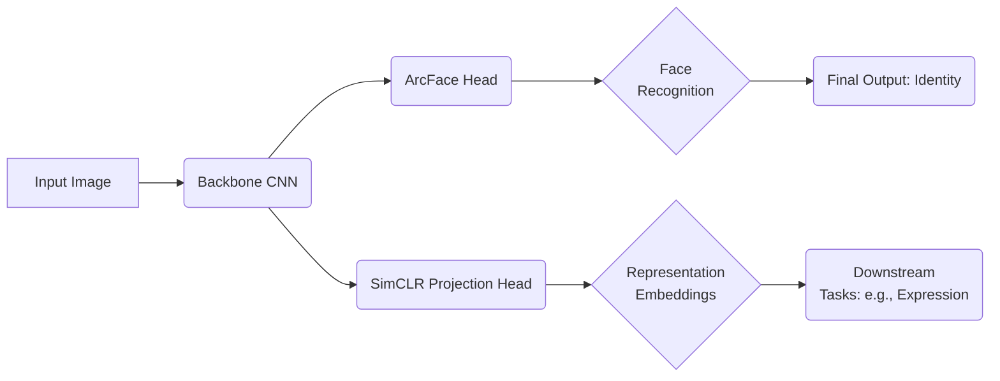

## • Goal
- Develop a **user-aware, emotion-recognizing model** that combines **face recognition** and **representation learning**.
- Integrate **test-time adaptation** for robust performance across various datasets (e.g., Koln, FERV39K, DFEW).
- Optimize the final model for **NVIDIA Orin** inference, including **Docker** environment setup, **ONNX** conversion, **quantization**, and **TensorRT** deployment.
- Utilize **RADIOv2**, a foundation model, to extract robust facial features for downstream tasks.

---

### 1. Project Overview

#### 1.1 Feature Extraction with RADIOv2
- **Foundation Model**: Leveraged **RADIOv2**, a pre-trained vision transformer, to extract high-quality facial features:
  $$
  F_{\text{RADIOv2}} = f_{\text{RADIOv2}}(I)
  $$
  where $I$ is the input image and $F_{\text{RADIOv2}}$ is the feature embedding.

#### 1.2 Test-Time Adaptation (Face Recognition)

- **Motivation**: Achieve stable, adaptive face recognition under domain shifts (lighting, pose, occlusions).
- **Approach**:  
  - Researched **test-time adaptation** methods to fine-tune model parameters during inference:
    $$
    W_{\text{new}} = W_{\text{old}} + \eta \cdot \nabla \mathcal{L}_{\text{TTA}}
    $$
    where $W_{\text{new}}$ are the updated weights, $\eta$ is the adaptation step size, and $\mathcal{L}_{\text{TTA}}$ is the test-time loss.

---

### 2. Face Recognition + Representation Learning

#### 2.1 Pipeline Design
The pipeline combines **RADIOv2**, **ArcFace**, and **SimCLR** to achieve robust identity verification and emotion recognition.

1. **Feature Extraction**  
   - Use **RADIOv2** to extract foundational facial embeddings:  
     $$
     F_{\text{Base}} = f_{\text{RADIOv2}}(I)
     $$

2. **Representation Learning**  
   - Apply **SimCLR** for contrastive learning:
     $$
     \mathcal{L}_{\text{SimCLR}} = -\log \frac{\exp(\text{sim}(z_i, z_j) / \tau)}{\sum_{k=1}^{N} \exp(\text{sim}(z_i, z_k) / \tau)}
     $$
     where $z_i$ and $z_j$ are projections of $F_{\text{Base}}$, $\text{sim}(\cdot)$ denotes cosine similarity, and $\tau$ is the temperature parameter.

3. **Classification (ArcFace)**  
   - Integrate an **ArcFace** head for face recognition:
     $$
     \mathcal{L}_{\text{ArcFace}} = -\log \frac{\exp(s \cdot (\cos(\theta_i + m)))}{\sum_{j=1}^{C} \exp(s \cdot \cos(\theta_j))}
     $$
     where $s$ is the scale factor, $\theta_i$ is the angle between features and weights, and $m$ is the margin penalty.

4. **Emotion Recognition Branch**  
   - Add an optional emotion recognition head trained on $F_{\text{Base}}$ for classification tasks:
     $$
     \mathcal{L}_{\text{Emotion}} = -\sum_{c=1}^{C} y_c \log \hat{y}_c
     $$

Fig 1. Proposed architecture combining ArcFace (face recognition) and SimCLR (representation learning). The same backbone is shared.

---

### 3. Training & Optimization

#### 3.1 Training Objectives
The model is trained with a combined loss function to balance face recognition, representation learning, and emotion classification:
$$
\mathcal{L}_{\text{Total}} = \alpha \mathcal{L}_{\text{ArcFace}} + \beta \mathcal{L}_{\text{SimCLR}} + \gamma \mathcal{L}_{\text{Emotion}}
$$
where $\alpha$, $\beta$, and $\gamma$ are weighting factors for multi-task learning.

---

#### 3.2 Deployment Optimization

#### **ONNX Conversion**
Converted PyTorch models to **ONNX** format for hardware-agnostic optimization:
$$
\text{Model}_{\text{ONNX}} = \text{Export}(\text{Model}_{\text{PyTorch}})
$$

#### **Quantization**
Reduced model precision to **INT8** or **FP16** to improve latency and reduce memory usage:
$$
\mathcal{Q}(x) = \frac{\text{round}(x \cdot 2^n)}{2^n}
$$
where $n$ determines the bit-width of quantization.

#### **TensorRT Deployment**
Deployed TensorRT-optimized engines on **NVIDIA Orin** to achieve real-time inference with high throughput.

---

### 4. NVIDIA Orin Inference & Performance

- **Batch Size**: 1  
- **Input Resolution**: $224 \times 224$  
- **Approximate Latency**: $15-20$ ms per frame ($\sim 50-65$ FPS).  
- **Pipeline Integration**: Integrated with **DeepStream** for multi-camera video streaming and real-time analysis.

---

### 5. Key Challenges & Solutions

#### **Test-Time Adaptation**
- **Challenge**: Adapting to domain shifts such as lighting changes and occlusions during inference.  
- **Solution**: Implemented test-time loss minimization to dynamically update weights:
  $$
  \mathcal{L}_{\text{TTA}} = \| F_{\text{Base}} - F_{\text{Adapted}} \|^2
  $$

#### **Representation Learning**
- **Challenge**: Balancing supervised learning (ArcFace) and unsupervised learning (SimCLR).  
- **Solution**: Introduced a weighted multi-task loss to alternate between classification and contrastive learning.

#### **Hardware Optimization**
- **Challenge**: Achieving real-time performance on constrained devices such as NVIDIA Orin.  
- **Solution**: Combined **ONNX conversion**, **quantization**, and **TensorRT optimization** to fully utilize Orin’s hardware acceleration capabilities.

---

### 6. Results & Conclusion

#### **Face Recognition**
- Achieved state-of-the-art accuracy with **ArcFace** and **RADIOv2** on WebFace and Celeb-1M datasets.

#### **Emotion Recognition**
- Demonstrated robust performance on FERV39K and DFEW datasets, showcasing strong generalization across different domains.

#### **Real-Time Feasibility**
- Achieved **50-65 FPS** inference speed on NVIDIA Orin, enabling real-time emotion detection and face recognition.

---

### **Overall**
This project highlights the successful integration of **RADIOv2**, multi-task learning, and hardware optimization. It delivers a robust, real-time solution for face recognition and emotion analysis that performs reliably across diverse conditions and datasets.
